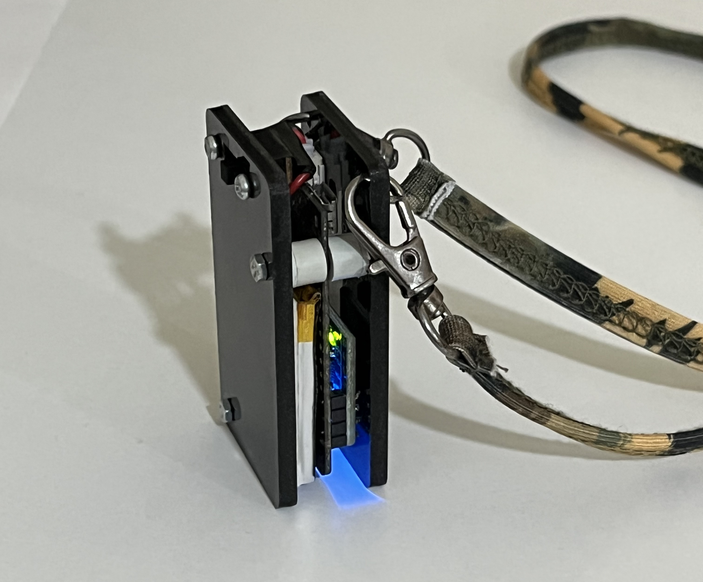

# dik-dur-ble

It is a posture monitoring device for software developers. 
Use with [my-back-gui](https://github.com/bariseksi/my-back-gui) desktop application which communicates with the device via bluetooth low energy.
## Components
- Lolin32 Lite
- MPU6050
- 3.7V 240mAh battery
- 3 Pin Switch
- 1K Resistors

   
  
  

